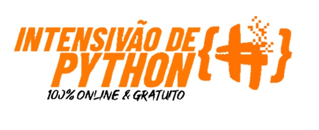

# Intensivão de Python - Hashtag Treinamentos

No Intensivão de Python feito pela Hashtag Treinamentos e realizado em 2021 foram abordados os seguintes assuntos:

Aula 1 - Automação de análise de dados e elaboração de relatórios.
Aula 2 - Análise de dados utilizando Pandas.
Aula 3 - Automação de processos usando Selenium.
Aula 4 - Modelo de previsão de resultados

Neste repositório estão disponíveis os materiais de estudos do intensivão
